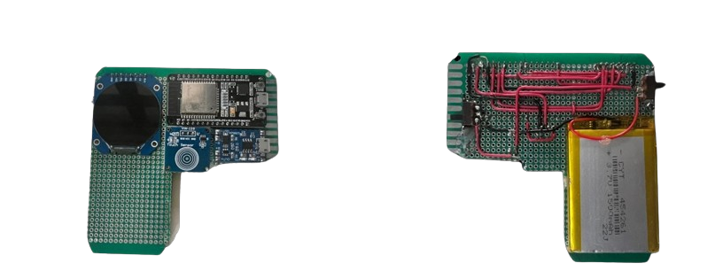
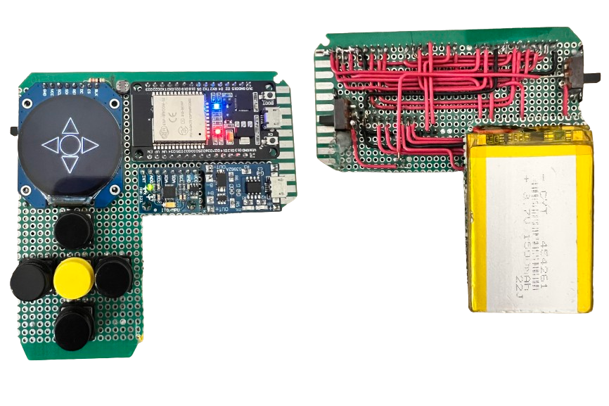

# Boomerang-32
Boomerang-32 is a electronics project centered around an ESP32 microcontroller. I will be adding different cool and interesting features as I go along!
 

## latest version: 
- Light dependent resistor
- Mpu 6050
- buttons
- new button testing interface

## Objectives
Create a handheld electronic device that has basic functionalities such as 
- 🔆dynamically changing screen brightness
- 🔋 displaying battery level
- 🎮 games
- 🤖 virtual Pets
- 🖥️ Network Monitor
- 📊 Resource Monitor
- ↔️ Interactive 3D Accelerometer display
- ...and more!
  
I will code everything from scratch using C++ so I can implement all the cool things that I wish to see!

## milestone 1:
- ✔️ screen brightness settings persists between on/off and can be changed.
- ✔️ a basic menu that can be navigated by a button. (currently only one touch sensor, I have yet to acquire enough buttons).

## milestone 2:
- ✔️ add atleast 4 buttons to the board.
- ✔️ use buttons to navigate the menu.
- install a Light dependent resistor to adjust screen brightness according to light source.
- replace the touch sensor with a accelerator+gyroscope module.
- wire up all components and wrap up all hardware installation.

## milestone 3:
- create a battery status indicator.
- a menu to display ambient temperature
- a menu to test button responsiveness

## I will start a daily log section, if you are interested in my development process
### day 3 (20/8/2024)
- I replaced the touch sensor with a accelerometer+gyroscope. I hope to use this sensor to awake the boomerang from deep sleep when the device is held up. (much like mordern smartphones)
- if the jumper wires arrive today I will complete everything in milestone #2.
- I need to implement a shorter and simpler button debounce logic wihtout compromising quality. button debounce is when a button is pressed once but makes contact with the circuit more than once, kind of like when you hit a ball once but it doesnt just hit the ground once, but multiple times before coming to a rest. This is problematic as the esp32 will interpret these bounces as additional clicks. we can use code to fix this issue, I just don't want to write long and complex logic that makes it harder to debug.

# Thats all folks (for now...)

