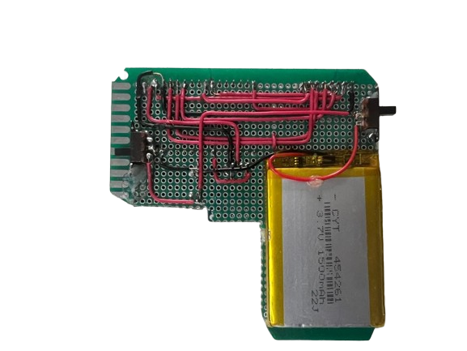
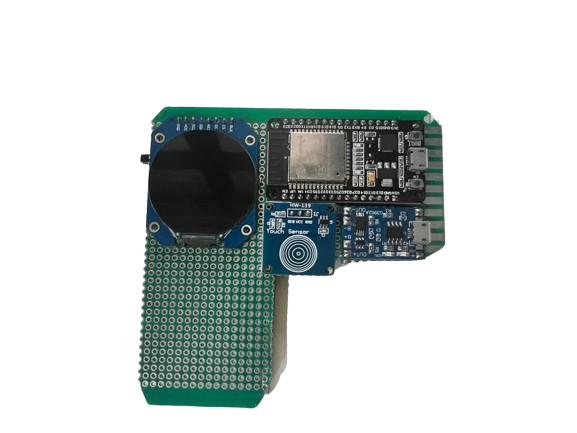

# Boomerang-32
Boomerang-32 is a electronics project centered around an ESP32 microcontroller. I will be adding different cool and interesting features as I go along!

## Objectivehttps://github.com/ZhengJiawen44/Boomerang-32/blob/main/README.md
Create a handheld electronic device that has bsaic functionalities such as changing screen brightness, displaying battery level, games, and much more! I will code everything from scratch using C++ so I can implement all the cool things that I wish to see!

## Project Hardware:

## milestone 1:
create an interactive menu, and implement screen brightness change functionality along with battery display
